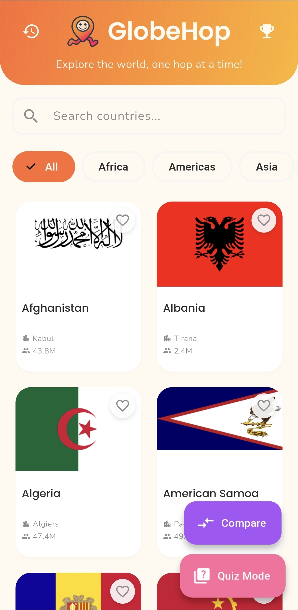
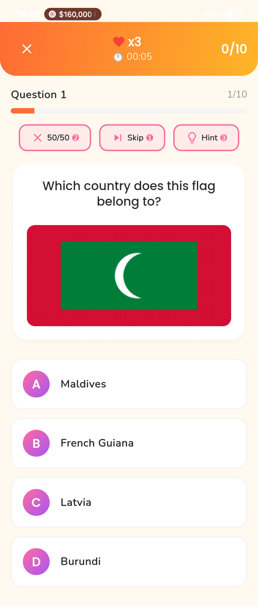
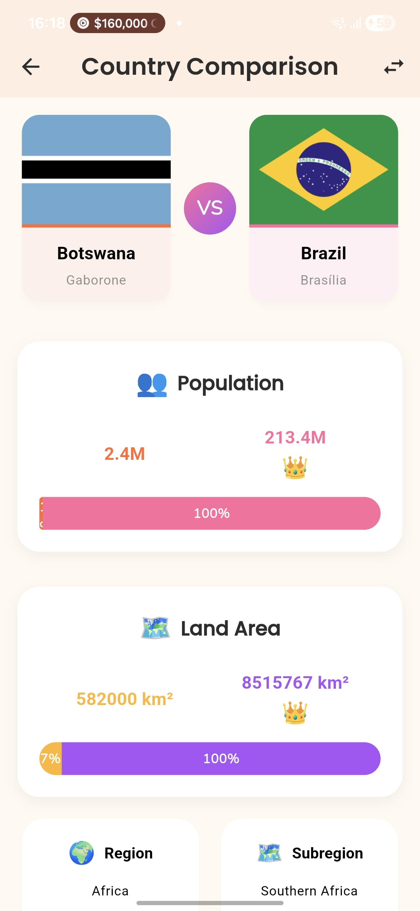
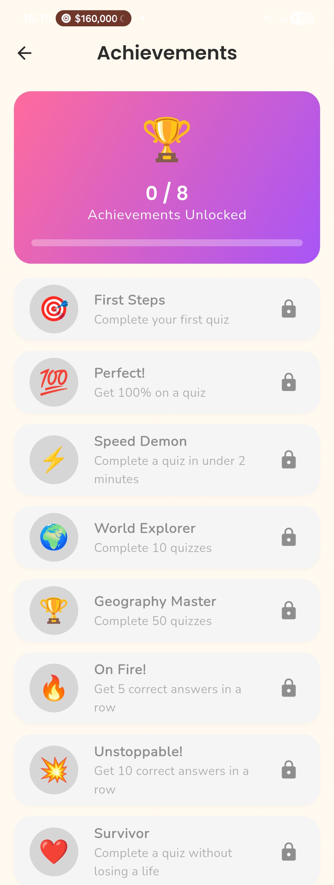

# 🗺️ GlobeHop

<div align="center">


**Explore the world, one hop at a time!**

[](https://flutter.dev)
[](LICENSE)
[](https://flutter.dev)

A playful, educational mobile app that makes learning about countries fun and interactive. Built with Flutter for a seamless cross-platform experience.

[Download on Google Play](#) • [View on App Store](#) • [Report Bug](https://github.com/yourusername/globehop/issues) • [Request Feature](https://github.com/yourusername/globehop/issues)

</div>

---

## ✨ Features

### 🌍 **Country Explorer**
- Browse **250+ countries** with beautiful flag displays
- **Search & filter** by region (Africa, Americas, Asia, Europe, Oceania)
- **Detailed information** including capital, population, area, languages, currencies
- **Save favorites** for quick access
- **Compare countries** side-by-side with visual charts

### 🎮 **Interactive Quiz Mode**
Choose from **3 quiz types**:
- 🏁 **Guess the Flag** - Identify countries by their flags
- 🏛️ **Guess the Capital** - Test your capital city knowledge
- 🌍 **Guess the Region** - Learn which continent countries belong to

**Quiz Features:**
- **3 Difficulty levels**: Easy (5), Medium (10), Hard (15) questions
- **Lives system** ❤️ - You have 3 hearts per quiz
- **Streak counter** 🔥 - Track consecutive correct answers
- **Speed bonus** ⚡ - Extra points for quick responses
- **Power-ups**: 50/50, Skip, and Hint to help you succeed

### 🏆 **Progress & Achievements**
- **8 Unique badges** to unlock:
  - 🎯 First Steps - Complete your first quiz
  - 💯 Perfect! - Get 100% on a quiz
  - ⚡ Speed Demon - Complete in under 2 minutes
  - 🌍 World Explorer - Complete 10 quizzes
  - 🏆 Geography Master - Complete 50 quizzes
  - 🔥 On Fire! - 5 correct in a row
  - 💥 Unstoppable! - 10 correct in a row
  - ❤️ Survivor - Complete without losing a life

- **Quiz history** with detailed statistics
- **High score tracking**
- **Personal progress dashboard**

### 📊 **Country Comparison**
- Select any **2 countries** to compare
- **Visual bar charts** showing population and area differences
- **Language analysis** - Common vs unique languages highlighted
- **Crown indicators** 👑 for winners in each category
- **Instant stats** on regions, currencies, and timezones

### 🌐 **Multi-Language Support**
- 🇬🇧 **English**
- 🇫🇷 **French** (Français)
- 🇪🇸 **Spanish** (Español)
- Automatically detects your phone's language

---

## 📱 Screenshots

<div align="center">

| Home Screen | Quiz Mode | Country Details |
|-------------|-----------|-----------------|
|  |  |  |

| Comparison | Achievements | Quiz Results |
|------------|--------------|--------------|
|  |  |  |

</div>

---

## 🚀 Getting Started

### Prerequisites
- Flutter SDK 3.0 or higher
- Dart 2.19 or higher
- Android Studio / VS Code with Flutter extensions
- An emulator or physical device

### Installation

1. **Clone the repository**
```bash
git clone https://github.com/yourusername/globehop.git
cd globehop
```

2. **Install dependencies**
```bash
flutter pub get
```

3. **Run the app**
```bash
flutter run
```

---

## 🏗️ Architecture

### Tech Stack
- **Framework**: Flutter 3.0+
- **State Management**: Provider
- **API**: REST Countries API (v3.1)
- **Local Storage**: SharedPreferences
- **Fonts**: Google Fonts (Poppins, Nunito)
- **Icons**: Material Icons + Custom assets

### Project Structure
```
lib/
├── config/
│   └── theme.dart              # App theme & colors
├── l10n/                       # Localization files
│   ├── app_localizations.dart
│   ├── app_en.dart             # English translations
│   ├── app_fr.dart             # French translations
│   └── app_es.dart             # Spanish translations
├── models/
│   ├── country.dart            # Country data model
│   └── quiz_question.dart      # Quiz models & achievements
├── providers/
│   ├── countries_provider.dart # Country data management
│   └── quiz_provider.dart      # Quiz logic & state
├── screens/
│   ├── home_screen.dart        # Main country browser
│   ├── country_detail_screen.dart
│   ├── quiz_screen.dart        # Quiz gameplay
│   ├── quiz_result_screen.dart
│   ├── quiz_history_screen.dart
│   ├── achievements_screen.dart
│   ├── comparison_screen.dart  # Country comparison
│   └── splash_screen.dart
├── services/
│   └── api_service.dart        # REST API integration
├── widgets/
│   ├── country_card.dart
│   └── loading_shimmer.dart
└── main.dart
```

---

## 🎨 Design System

### Color Palette
```dart
Sunset Orange:  #FF6B35  // Primary brand color
Mango Yellow:   #FFB627  // Secondary/accent
Bubblegum Pink: #FF6B9D  // Tertiary/playful
Grape Purple:   #A855F7  // Special elements
Lime Zest:      #90EE90  // Success states
Coral Blush:    #FF8FAB  // Soft accents
Cream:          #FFF9F0  // Backgrounds
Charcoal:       #2D2D2D  // Text
```

### Typography
- **Display**: Poppins (Bold/SemiBold)
- **Body**: Nunito (Regular/SemiBold)
- Rounded, friendly, and highly legible

---

## 🌐 API

**Data Source**: [REST Countries API](https://restcountries.com/)
- Provides comprehensive country information
- Free and open source
- No authentication required
- Returns data in JSON format

**Endpoints Used:**
```
GET /v3.1/all                    # All countries
GET /v3.1/region/{region}        # Filter by region
GET /v3.1/name/{name}            # Search by name
GET /v3.1/alpha/{code}           # Get by country code
```

---

## 🤝 Contributing

Contributions are welcome! Please feel free to submit a Pull Request.

1. Fork the Project
2. Create your Feature Branch (`git checkout -b feature/AmazingFeature`)
3. Commit your Changes (`git commit -m 'Add some AmazingFeature'`)
4. Push to the Branch (`git push origin feature/AmazingFeature`)
5. Open a Pull Request

---

## 📋 Roadmap

- [x] Country browsing & search
- [x] Multiple quiz types
- [x] Lives & streak system
- [x] Power-ups (50/50, Skip, Hint)
- [x] Achievements system
- [x] Country comparison
- [x] Multi-language support
- [ ] Dark mode
- [ ] Social sharing
- [ ] Daily challenges
- [ ] Leaderboard system
- [ ] Offline mode
- [ ] More languages (German, Portuguese, Arabic, etc.)

---

## 🐛 Known Issues

- Region quiz might show fewer than 4 options if not enough regions available (rare edge case)
- Some country names are very long and may truncate in certain views

---

## 📄 License

This project is licensed under the MIT License - see the [LICENSE](LICENSE) file for details.

---

## 👨‍💻 Author

**Your Name**
- GitHub: [@yourusername](https://github.com/yourusername)
- Portfolio: [yourwebsite.com](https://yourwebsite.com)
- Email: your.email@example.com

---

## 🙏 Acknowledgments

- [REST Countries API](https://restcountries.com/) for providing comprehensive country data
- [Flutter](https://flutter.dev/) for the amazing framework
- [Google Fonts](https://fonts.google.com/) for beautiful typography
- All the amazing Flutter packages used in this project

---

## 📊 Stats


---

<div align="center">

**Made with ❤️ and Flutter**

If you found this project helpful, please give it a ⭐️!

</div>